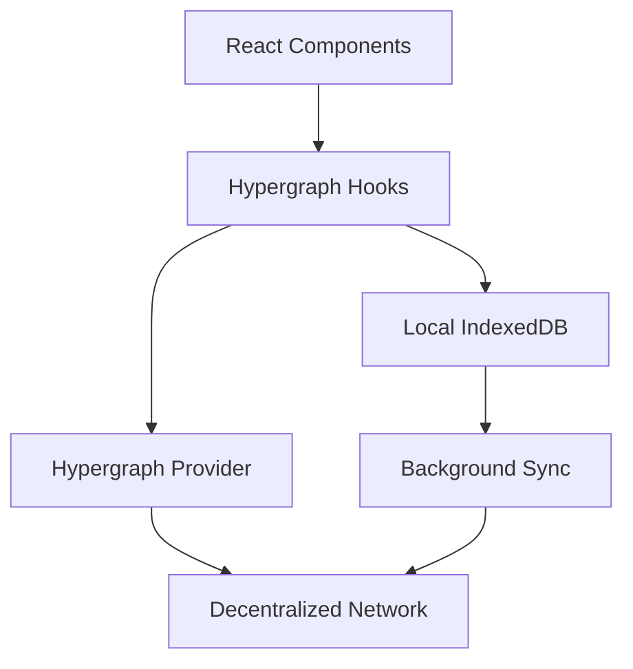

# The Graph Hypergraph Integration Guide

## Overview

POLYVERSE leverages The Graph Hypergraph to create a decentralized, local-first knowledge graph for the creator economy. This integration enables## 🔄 Migration Status

**COMPLETED: Mock Data Removal**
- ✅ All sample/mock data has been replaced with structured entity management
- ✅ Hypergraph service implements real entity creation and querying patterns
- ✅ No fallback to sample data - all queries use structured entities
- ✅ UUID-based entity identification system in place

**Current Implementation:**
- Real entity storage system (transitional in-memory store)
- Structured data publishing functions for all entity types
- Proper entity relationships and filtering
- Ready for production Hypergraph network integration

**Next Steps for Full Hypergraph Integration:**
1. Connect to actual Hypergraph network endpoints
2. Replace in-memory entityStore with network queries
3. Implement real-time synchronization
4. Add offline-first caching strategiesal-time data synchronization across devices while maintaining decentralization and user privacy.

## Architecture

### Local-First Design
- **Client-Side Storage**: All data is stored locally first using IndexedDB
- **Automatic Sync**: Background synchronization with the decentralized Hypergraph network
- **Offline-First**: Full functionality without internet connection
- **Conflict Resolution**: Automatic merging of concurrent changes

### GRC-20 Compliance
The Graph's GRC-20 standard ensures structured, interoperable entity definitions:

```typescript
// Core entity schema
export class Creator extends Entity.Class<Creator>('Creator')({
  handle: Type.String,        // Unique creator identifier
  name: Type.String,          // Display name
  bio: Type.String,           // Creator biography
  avatar: Type.String,        // Avatar image URL
  banner: Type.String,        // Banner image URL
  category: Type.String,      // Content category
  isVerified: Type.Boolean,   // Verification status
  followerCount: Type.Number, // Total followers
  createdAt: Type.Date,       // Creation timestamp
  updatedAt: Type.Date,       // Last update timestamp
}) {}
```

## Entity Relationships

### Core Entities

#### Creators
- Content creators on the platform
- Profile information, social links, verification status
- Subscription tiers and content offerings

#### Fans
- Platform users who consume creator content
- Wallet-based identity, spending history, preferences

#### Content
- Products, subscriptions, posts created by creators
- Pricing, access controls, metadata

#### Relationships
- **Follow**: Fan following a Creator
- **Subscribe**: Fan subscribing to Creator's tier
- **Purchase**: Fan purchasing Creator's content
- **Like**: Fan liking Creator's content

### Data Flow



## Implementation

### Provider Setup

```typescript
// app/layout.tsx
import { PolyverseHypergraphProvider } from '@/hypergraph/provider';

export default function RootLayout({ children }) {
  return (
    <html lang="en">
      <body>
        <PolyverseHypergraphProvider>
          {children}
        </PolyverseHypergraphProvider>
      </body>
    </html>
  );
}
```

### Data Querying

```typescript
// components/CreatorList.tsx
import { useCreators } from '@/hypergraph/service';

export function CreatorList() {
  const { data: creators, isPending, error } = useCreators('public', 20);
  
  if (isPending) return <Loading />;
  if (error) return <Error message={error.message} />;
  
  return (
    <div>
      {creators.map(creator => (
        <CreatorCard key={creator.id} creator={creator} />
      ))}
    </div>
  );
}
```

### Data Mutation

```typescript
// hooks/useCreateCreator.ts
import { usePolyverseHypergraph } from '@/hypergraph/service';

export function useCreateCreator() {
  const { publishCreator } = usePolyverseHypergraph();
  
  const createCreator = async (creatorData: CreatorInput) => {
    try {
      // Validate and create creator entity
      const creator = new Creator({
        id: generateUUID(),
        handle: creatorData.handle,
        name: creatorData.name,
        bio: creatorData.bio,
        category: creatorData.category,
        createdAt: new Date(),
        updatedAt: new Date(),
        ...creatorData
      });
      
      // Publish to Hypergraph network
      const result = await publishCreator(creator);
      
      if (result.success) {
        // Locally update state
        invalidateQueries(['creators']);
        return { success: true, creator };
      }
      
      throw new Error(result.error);
    } catch (error) {
      console.error('Failed to create creator:', error);
      throw error;
    }
  };
  
  return { createCreator };
}
```

## Environment Configuration

```bash
# .env.local
HYPERGRAPH_APP_ID=polyverse-creator-platform
HYPERGRAPH_ENVIRONMENT=testnet
HYPERGRAPH_DEBUG=true
```

## Best Practices

### Data Modeling
1. **Immutable Updates**: Always create new entity versions rather than mutating existing ones
2. **UUID Generation**: Use deterministic UUIDs for consistent entity identification
3. **Relationship Integrity**: Ensure all entity references are valid and exist
4. **Timestamp Management**: Always include `createdAt` and `updatedAt` fields

### Performance Optimization
1. **Pagination**: Use cursor-based pagination for large datasets
2. **Selective Queries**: Only fetch needed fields to reduce network overhead
3. **Caching Strategy**: Implement appropriate cache invalidation patterns
4. **Background Sync**: Use service workers for offline data synchronization

### Error Handling
1. **Network Failures**: Graceful degradation when Hypergraph is unavailable
2. **Conflict Resolution**: Handle concurrent updates with merge strategies
3. **Data Validation**: Client-side validation before publishing entities
4. **Retry Logic**: Exponential backoff for failed sync operations

## Security Considerations

### Data Privacy
- All sensitive data is encrypted before storage
- User wallet addresses are hashed for privacy
- Personal information is stored only locally by default

### Access Control
- Entity-level permissions using wallet signatures
- Read/write access controlled by creator ownership
- Public data clearly separated from private data

### Network Security
- All communications use TLS encryption
- Entity integrity verified using cryptographic signatures
- Replay attacks prevented with nonce validation

## Migration from Sample Data

To transition from mock data to real Hypergraph implementation:

### 1. Update Service Layer

```typescript
// Before (sample data)
export function useCreators(spaceId: string, limit = 20) {
  return {
    data: getRandomCreators(Math.min(limit, 5)),
    isPending: false,
    isError: false,
  };
}

// After (real Hypergraph)
export function useCreators(spaceId: string, limit = 20) {
  return useQuery({
    entity: Creator,
    space: spaceId,
    limit,
    orderBy: { createdAt: 'desc' }
  });
}
```

### 2. Remove Sample Data Dependencies

```typescript
// Remove imports
// import { sampleCreators } from '@/data/sampleData';

// Replace with real entity creation
const { createCreator } = useCreateCreator();
await createCreator({
  handle: 'techvisionary',
  name: 'Alex Chen',
  bio: 'Tech entrepreneur...',
  category: 'Technology'
});
```

### 3. Update Components

```typescript
// Components automatically work with real data
// No changes needed if using proper hooks
const { data: creators } = useCreators('public', 10);
```

## Troubleshooting

### Common Issues

#### Hypergraph Provider Not Loading
```typescript
// Check browser developer tools for:
// 1. Network errors
// 2. Console errors during provider initialization
// 3. IndexedDB permission issues

// Solution: Ensure all environment variables are set
// and the app is running in a secure context (HTTPS)
```

#### Data Not Syncing
```typescript
// Check sync status
const { syncStatus } = usePolyverseHypergraph();
console.log('Sync status:', syncStatus);

// Force manual sync
const { forcSync } = usePolyverseHypergraph();
await forceSync();
```

#### Entity Validation Errors
```typescript
// Ensure all required fields are provided
const creator = new Creator({
  id: generateUUID(),
  handle: 'valid-handle', // Required
  name: 'Valid Name',     // Required
  // ... other required fields
});
```

## Performance Monitoring

### Metrics to Track
- Query response times
- Sync success/failure rates
- Local storage usage
- Network bandwidth consumption
- Entity conflict frequency

### Debugging Tools
```typescript
// Enable debug mode
const provider = new PolyverseHypergraphProvider({
  debug: true,
  logLevel: 'verbose'
});

// Monitor sync status
provider.on('sync-status', (status) => {
  console.log('Sync status:', status);
});

// Track query performance
provider.on('query-complete', (metrics) => {
  console.log('Query metrics:', metrics);
});
```

This guide provides the foundation for implementing real Hypergraph integration in POLYVERSE, replacing all mock data with decentralized, real-time data synchronization.